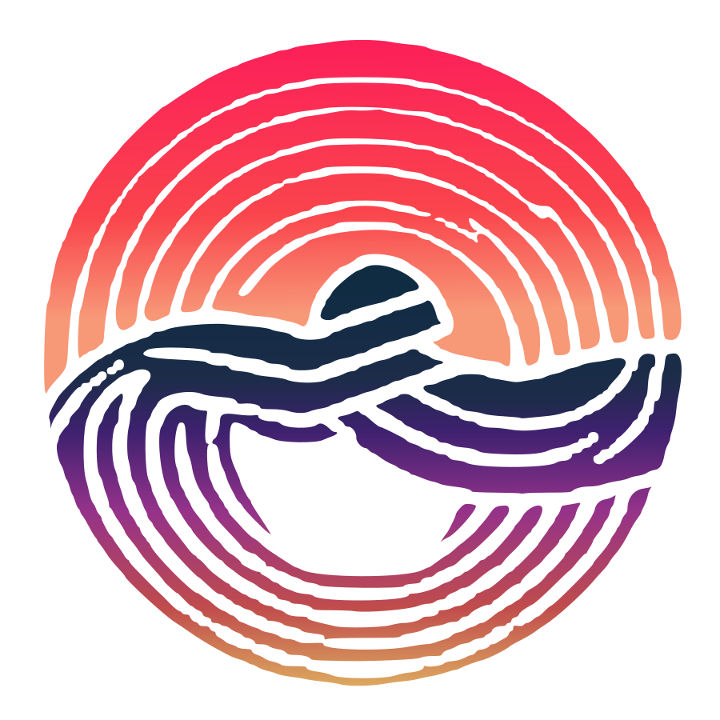
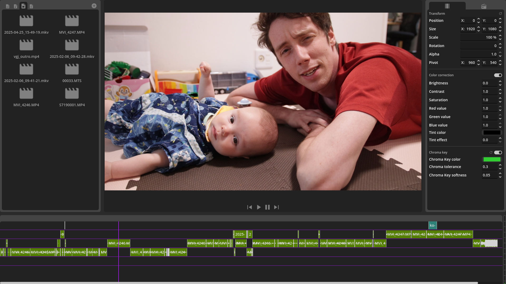

# GoZen

  

*The Minimalist Video Editor*

> [!IMPORTANT]  
> GoZen is currently in Alpha! Expect bugs and frequent changes to happen! Beta release is planned for late 2025.
> 
> Visit the [GoZen project site](https://voylinsgamedevjourney.github.io/gozen/) for more information and updates.

## What is GoZen?
GoZen is a lightweight, stable, minimalistic, and performant video editor with simplicity in mind. Built using the Godot game engine, GoZen aims to provide a focused video editing  experience without the complexity which other traditional NLE's. It is primarily developed for Linux but includes support for Windows, MacOS support will come in the future.

## Features

- Smooth video playback;
- Fast rendering;
- Crash free;
- Support for all codecs (which FFmpeg supports);
- Clean, minimalist, but usable UI;
- Cross-platform (Linux, Windows);

## UI overview

The top left displays your media pool, listing your files by type and alphabetically. In the top center you have your video project playback itself with on the right of that your effects panel.

On the bottom you have your timeline with on the right your audio meter to check if your audio is clipping or not.

## Installation
Due to GoZen still being in alpha, there is no available build yet through each distro's package manager (an AUR build is coming). The best way to download the most recent version is through following links:
- [GitHub release page](https://github.com/VoylinsGamedevJourney/gozen/releases);
- [Itch.io page](https://voylin.itch.io/gozen);
- [GoZen AUR](https://aur.archlinux.org/packages/gozen);
- [GoZen-git AUR](https://aur.archlinux.org/packages/gozen); (This is the most up to-date, but most likely to break)

At this moment there are three builds:
- Linux: This version works on more up-to-date distro's;
- AppImage: This works on all distro's;
- AUR: For Arch Linux users, there is a normal version and a git version available;
- Windows: ...;

### For developers (building from source)
First of all, you'll need to go into the `libs` folder and run the python script `build.py`, just follow the instructions and it should compile FFmpeg and the GDExtension without issues (on both Linux and Windows). From there you can just open the GoZen project from Godot and you're good to go to use/export the project from there.

> [!NOTE]
> You will need `git-svn` in order to compile the Linux builds!

## Contributing
We welcome contributions to GoZen wether it's reporting bugs, suggesting features, submitting code, ... all help is appreciated.

Please read our [Contributing Guide](./CONTRIBUTING.md) for more details on how to get involved.

Join our [Discord server](https://discord.gg/BdbUf7VKYC) to discuss the GoZen project and ask questions!

### Localization
We need contributors for the localization of GoZen, more info can be found in [the translation README](/src/translations/README.md)

## Support the project ❤️
GoZen is an open-source project developed by me, Voylin. I'm a stay-at-home dad and my time is limited as I'm trying to make it financially work to keep working from home.

If you find GoZen useful and would like to give me more time and resources to work on this project, you can financially support me through [my Ko-fi page](https://ko-fi.com/voylin).

### Becoming a sponsor
If you have interest in becoming a sponsor to the GoZen project, please visit [this form](https://forms.gle/boBG9UB6ouSg8vce9) and fill in the details. We'll reply as soon as we can.

## Changelog
See the [CHANGELOG.md](./CHANGELOG.md) file for an overview of all changes to the projects from version to version.

## About GoZen
I named the editor GoZen, **Go** comes from Godot and **Zen** from ... zen. The name implies that the video editor is made in Godot, and that it's a _zen-like_ experience to use. 午前 (Gozen) also means morning in Japanese, that's why the logo represents a rising sun.

I'm a morning person and seeing/feeling the sunrise each morning always makes me feel like I'll have a productive day, so the meaning of GoZen for me links to being productive and having a zen experience whilst editing videos.

## License

The project is licensed under the [GPLv3 license](./LICENSE). FFmpeg is being used which has it's own license as well, for compiling FFmpeg we use the `--enable-gpl3` flag.

> This software uses libraries from the FFmpeg project under the LGPLv2.1
> Other libraries used may come with their own specific licenses so be sure to check before forking the project and/or using code from this project to see if it can be used with your project license.

